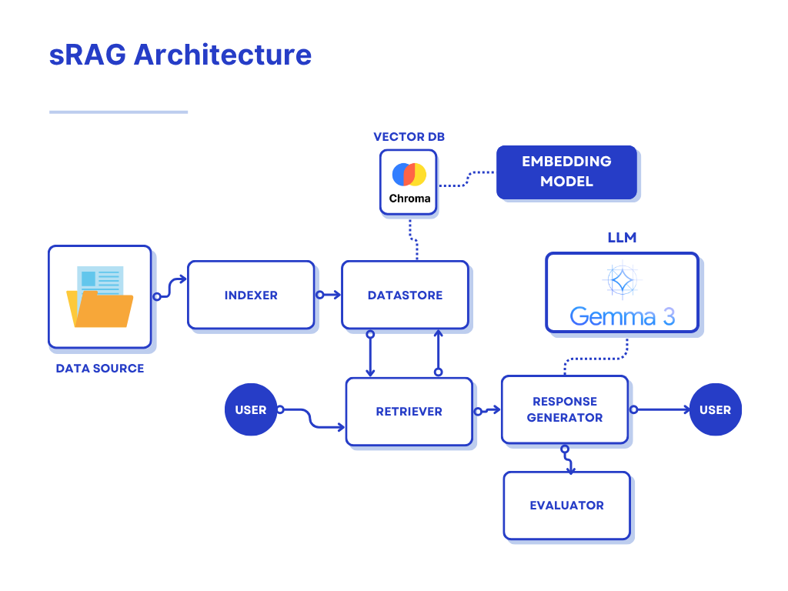

# sRAG — Secure Retrieval Augmented Generation

A full-stack, secure Retrieval Augmented Generation (RAG) system. sRAG indexes your documents, retrieves relevant context, generates AI-powered responses, and evaluates results - all while safeguarding data confidentiality.

Full writeup/demo can be found here: *blog link*



---

## Features

- **Document Indexing:** Parse and chunk documents for efficient retrieval.
- **Contextual Retrieval:** Retrieve relevant context for user queries using ChromaDB.
- **AI-Powered Responses:** Generate answers using LLMs (Ollama + Gemma3 4B QAT).
- **Evaluation Workflow:** Built-in evaluation of RAG pipeline performance.
- **Secure by Design:** Keeps your data private and local.

---

## Technology Stack

- **Frontend:** Next.js (React, Tailwind CSS)
- **API:** Python FastAPI
- **Parsing/Chunking:** Docling
- **Vector Database:** ChromaDB
- **Embedding Model:** all-MiniLM-L6-v2
- **LLM:** Ollama (Gemma3 4B QAT)

---

## Getting Started

### Prerequisites

- [Docker](https://www.docker.com/)
- [Docker Compose](https://docs.docker.com/compose/)

### Local Deployment

Clone the repository and run:

```sh
docker compose up --build -d
```

This will build and start all necessary containers (UI, API, ChromaDB, Ollama).

To stop and remove all containers and volumes:

```sh
docker compose down -v
```

---

## Usage

- Access the web UI at [http://localhost:3000](http://localhost:3000)
- Use the chat interface to ask questions about your documents.
- Use the UI buttons to reset the database, load documents, or trigger evaluation.

---

## Project Structure

```
.
├── api/                        # FastAPI backend
│   ├── main.py                 # Entry point to run the API
│   ├── dataset/                # Example documents and evaluation data
│   └── src/                    # Source code for the backend
│       ├── rag_pipeline.py     # RAG pipeline implementation
│       ├── impl/               # Implementations of core components (datastore, indexer, etc.)
│       ├── interface/          # Interfaces/abstract base classes for components
│       ├── util/               # Utility functions
│       └── ...                 # Other backend code
├── ui/                         # Next.js frontend
├── chroma_db/                  # ChromaDB config
├── compose.yml                 # Docker Compose configuration
└──

```

---
